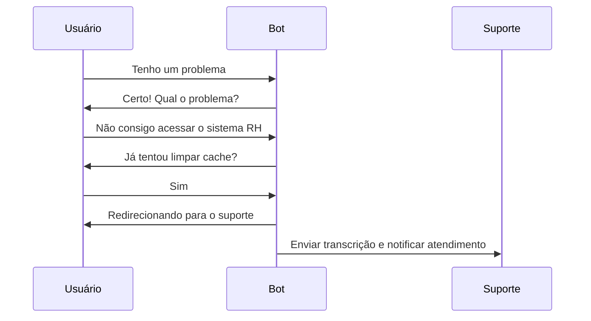
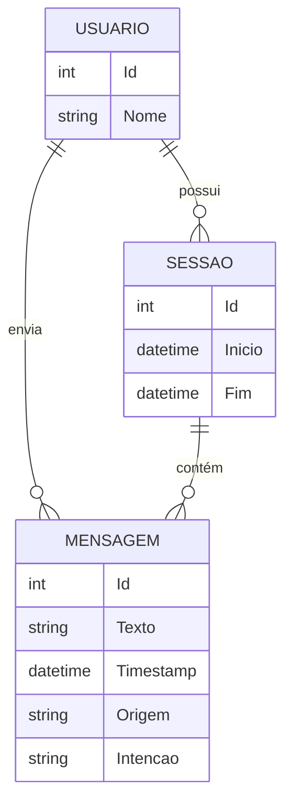
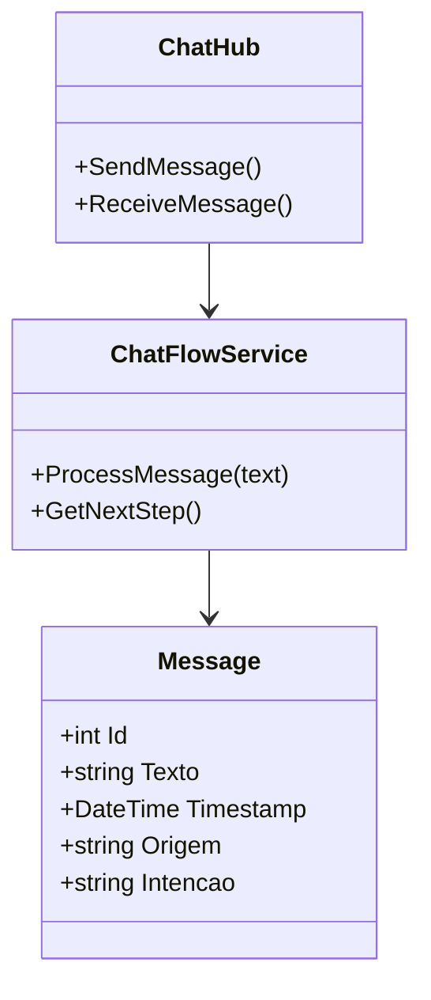

# 📊 Diagramas do Projeto Chatbot

Este documento contém os diagramas de entidades, classes e fluxo do projeto **Chatbot Inteligente**.

---

## 🧠 1. Fluxo de Conversa (Mermaid)

---

## 🗃️ 2. Diagrama Entidade-Relacionamento (simplificado)

---

## 🧱 3. Diagrama de Classes (backend)

---

## 📍 Localização no Projeto

Este arquivo pode ser encontrado em: `docs/diagramas.md`
